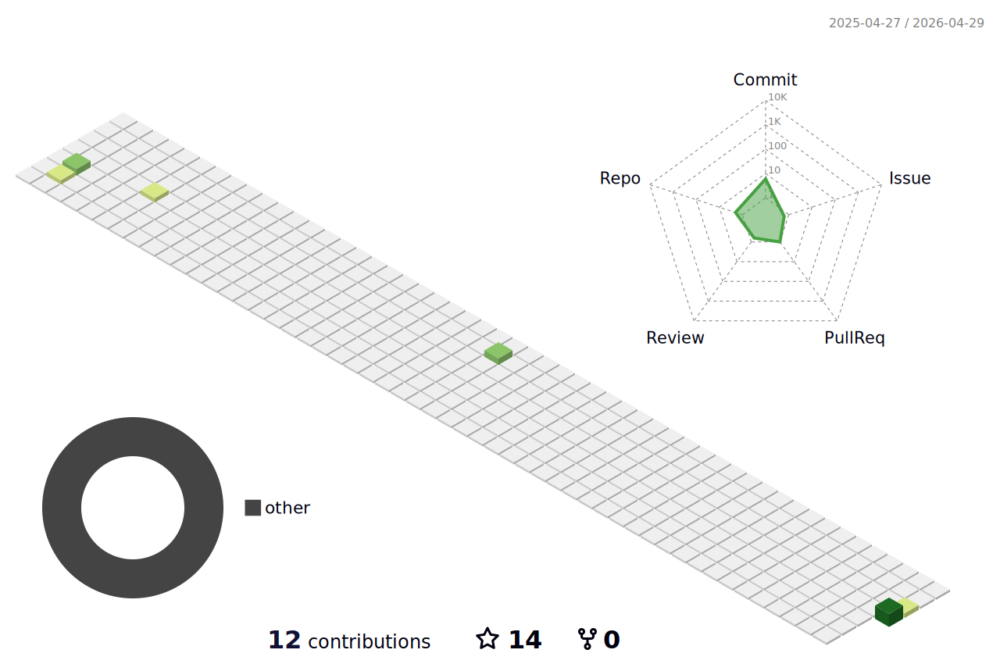

### Hi there 👋, my name is Baylak 🫡
#### I am a DevOps engineer.
I love cats, programming, automation, DIY projects, and exploring different technologies. I'm also passionate about plants and enjoy gardening in my free time.

Skills: Kubernetes, Docker, Python, C, C#, Ansible, Jenkins, Gitlab CI, Github Actions, Grafana, Zabbix, Prometheus, Linux, Kafka, RabbitMQ, Flink, PostgreSQL, Clickhouse, Redis, MongoDB, Computer Networks, s3, HashiCorp Vault

 
